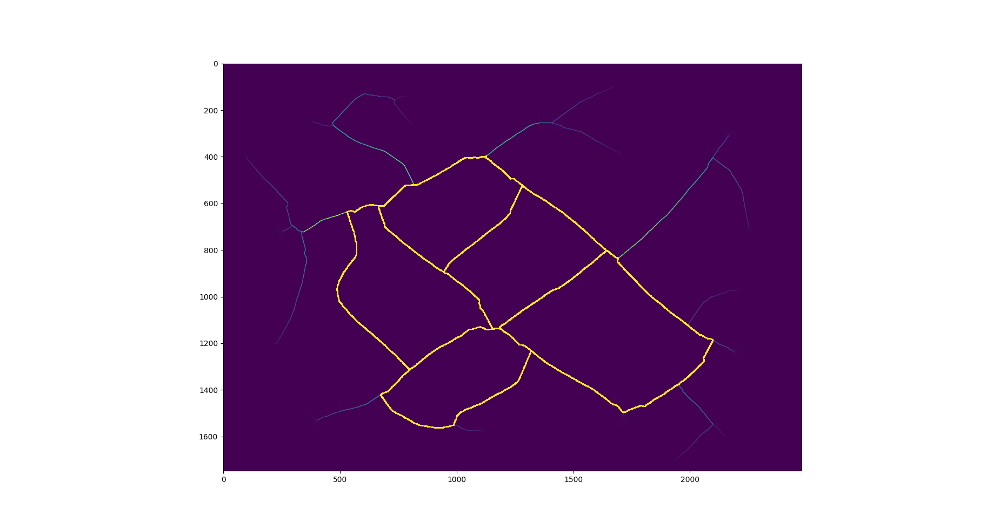
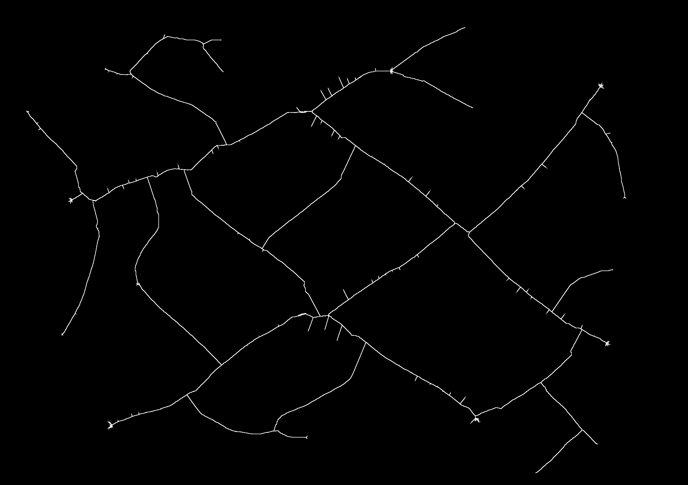
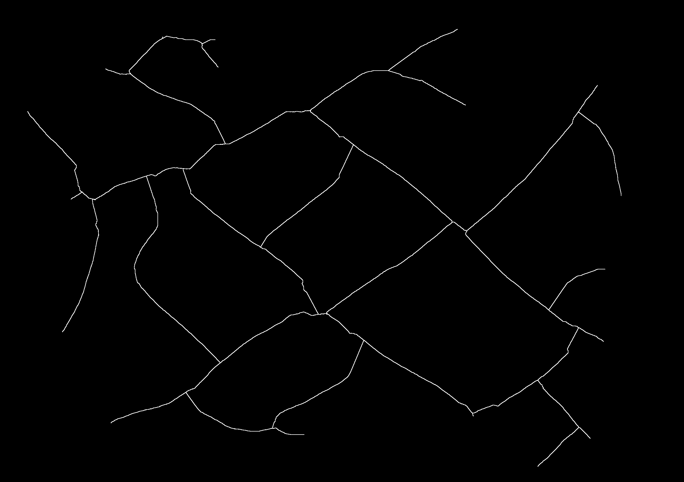
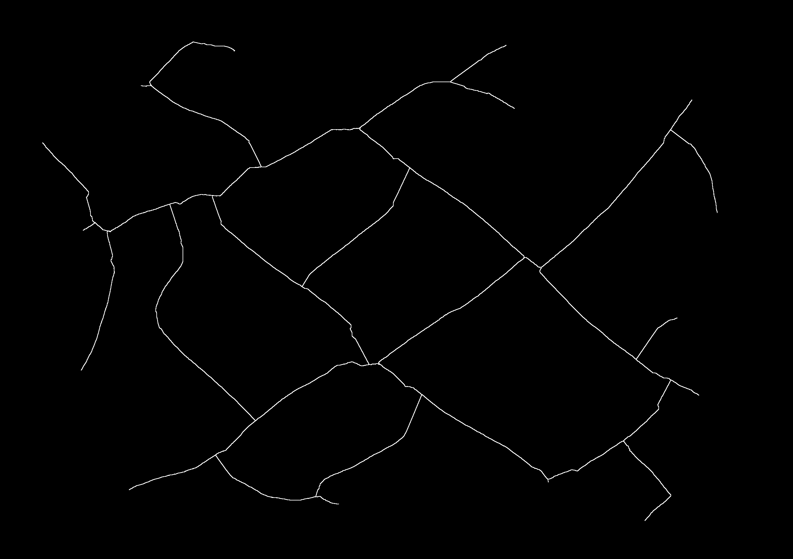

# afmm
This package implements an augmented fast marching method algorithm for skeletonization of binary masks in Go, as provided by Alexandru C. Telea and Jarke J. van Wijk in <em>Telea, A. C., & Wijk, van, J. J. (2002). An augmented Fast Marching Method for computing skeletons and centerlines. In Proceedings of the symposium on Data Visualization 2002 (VisSym'02, Barcelona, May 27-29, 2002) (pp. 251-259). Eurographics Association</em>.

There are three main routines exported by this package, the simplest of which is a distance transform of the binary mask using the fast marching method (FMM). Then we augment this algorithm to take into account the source pixel at the boundary with (AFMM). This function returns the discontinuity magnitude field of these sources, implying a centerline. Finally, we have the all-in-one function Skeletonize which takes in a picture and a threshold <em>t</em>. It performs AFMM and then thresholds the discontinuity field to extract a new grayscale image.Image containing the skeleton and ignoring boundary effects smaller than <em>t</em> pixels.

## Usage

Say we have an image in the PNG format which we read into an image.Image variable as follows

```{.go}
  // "os" and "image" imported

  reader, err := os.Open('./example.png')
  if err != nil {
      log.Fatal(err)
  }
  
  img, _, err := image.Decode(reader)
  if err != nil {
    log.Fatal(err)
  }
```

With example.png being the image


The result of ```afmm.FMM(img)``` is the distance transform in a contiguous array. After reshaping it into the shape of the image we get

.

The output of ```afmm.AFMM(img)``` on an image is a slice of floats which is higher at the centerlines, also in a contiguous fashion and requires the same reshaping as afmm.FMM. For the above example, we get

.

Finally, the output of ```afmm.Skeletonize(img, t)``` is an image.Image where we threshold the above data by t. Different values of t yield different skeletons. For instance, for <em>t</em>=20, 100 and 250: 






